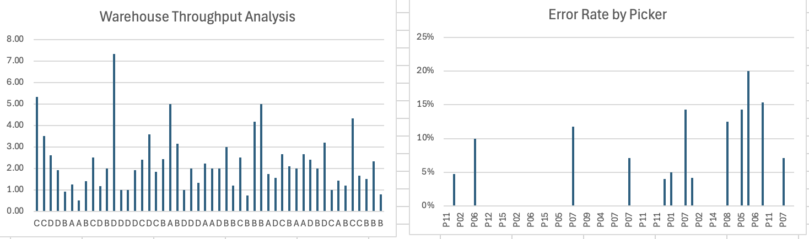

# Tesla Warehouse Automation – Excel VBA Project

## Overview
This project demonstrates automation of warehouse operational data using Excel VBA.

The macro processes raw warehouse order data and automatically calculates key performance indicators (KPIs) used in supply chain analytics.

## Features
• Automated data processing using VBA  
• Throughput calculation (Items picked per minute)  
• Error rate analysis  
• Clean dataset generation for dashboards  

## Technologies
Excel  
VBA (Visual Basic for Applications)

## KPI Metrics
Throughput = Items / Time_Min  
Error Rate = Errors / Items

## Use Case
This automation simulates analytics workflows used in warehouse operations at companies like Tesla, Toyota, and Amazon.
